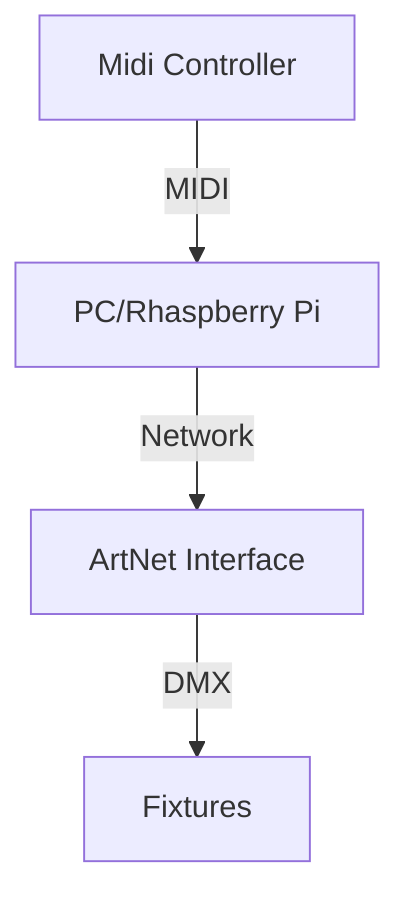

dmx-control
===========

The goal of this project is to have a light show with playing, while not having
to deal with the controls.

Hardware used
-------------

The Midi Controller I use is a [FCB1010][fcb1010]. As computer, I'll either use
a standard laptop that is available or a [Rhaspberry Pi][raspberry]. Any
[ArtNet][artnet] and any fixtures can then be used.

Expected Workflow
-----------------

The idea is to configure the Midi Controller to be able to have some standard
pedals per patch and use the remaining pedals to switch between programs.

A Program will have some default scenes like `Blackout`, `Verse`, `Chorus`,
`Bridge`, `Flash` which can be triggered/switched using the Midi Controller.
Synchronization is a later topic.

[fcb1010]: https://www.behringer.com/product.html?modelCode=P0089
[raspberry]: https://www.raspberrypi.org/
[artnet]: https://art-net.org.uk/
